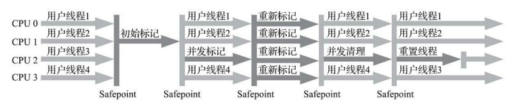

# CMS(Concurrent Mark Sweep)

以获取最短停顿时间为目标的收集器

收集算法：标记-清除

#### 收集流程
1. 初始标记(CMS initial mark) -> STW  
   仅标记GC Roots 直接关联的对象，速度很快
2. 并发标记(CMS concurrent mark)  
   从GC Roots直接关联的对象遍历整个对象图，和用户线程并发运行
3. 重新标记(CMS remark) -> STW  
   修正并发标记期间产生的变动的部分，比初始标记时间长，但远快于并发标记时间
4. 并发清除(CMS concurrent sweep)
    清理删除掉标记为死亡的对象，由于不需要移动存活对象，因此可以和用户线程并行

#### 缺点
1. 对cpu要求高  
    虽然可以和用户线程并行执行，但需要占用一部分线程（cpu的计算能力）。默认启动的回收线程数为(cpu核数+3)/4，
    在核数>=4时，影响较小，在cpu核数<4时，对用户线程影响较大
2. 无法处理浮动垃圾(Floating Garbage)  
    在并发标记和并发清理阶段，产生新的垃圾，由于在标记后出现，需要在下一次垃圾回收时在清理。
3. 需要预留内存空间
    垃圾收集需要与用户线程并发执行，因此不能等老年代几乎被占满后在收集，而需要预留部分空间给用户线程并行执行。
    JDK5的默认触发阈值为68%，JDK6为92%。
4. 并发失败(**Concurrent Mode Failure**)  
    预留的内存空间不满足用户线程继续运行时分配新对象的需要，需要启动后备方案: 冻结用户线程的执行，临时启用Serial Old进行老年代的垃圾收集，这样停顿时间将很长。
5. 标记-碎片清除算法导致的空间碎片  
    碎片过多时，即使老年代还有很多剩余空间，也可能会找不到一块连续内存来分配大对象，而不得不提前触发Full GC

#### 相关JVM参数
* -XX：CMSInitiatingOccupancyFraction  
    启动垃圾回收的阈值
* -XX：+UseCMS-CompactAtFullCollection(JDK9开始废弃)  
    在不得不进行Full GC时整合内存碎片，这样又会导致停顿时间变长
* -XX：CMSFullGCsBeforeCompaction(JDK9开始废弃)  
    执行若干次不整理空间的Full GC后，下一次进入Full GC前会先进行碎片整理