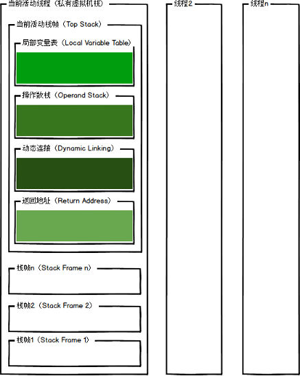

# 虚拟机栈
线程私有

用于临时计算的区域，分为入栈（将计算需要的数据以及计算的结果压入栈）和出栈（将计算的结果出栈）

#### 栈帧内容:
* 局部变量表
    - 存储方法参数和方法内局部变量: 八大基础类型（int boolean double long byte char float short）+ 对象引用(reference)+returnAddress（为jsr、jsr_w和ret指令服务的，目前已经很少使用了）
* 操作数栈
    - 用于临时计算的区域，分为入栈（将计算需要的数据以及计算的结果压入栈）和出栈（将计算的结果出栈）
* 动态链接
* 返回地址Return address
* 附加信息



#### 一个栈帧变化的实例
```java
    private static int add(int c){  
        return c + 10;  
    }  
      
    public static void main(String[] args) {  
        int a, b, c;  
        a = 1;  
        b = 2;  
        c = add(a*b);  
        c = c*(a+b);  
    } 
```
```text
    0: iconst_1        （把1压入操作数栈栈顶）  
    1: istore_1        （把操作数栈栈顶的出栈放入局部变量表索引为1的位置）  
    2: iconst_2        （把2压入操作数栈栈顶）  
    3: istore_2        （把操作数栈栈顶的出栈放入局部变量表索引为2的位置）  
    4: iload_1         （把局部变量表索引为1的值放入操作数栈栈顶）  
    5: iload_2          （把局部变量表索引为2的值放入操作数栈栈顶）  
    6: imul                （把操作数栈栈顶的和栈顶下面的一个进行乘法运算后放入栈顶）  
    7: invokestatic  #2                  // Method add:(I)I    （执行静态方法，返回的值放入操作数栈）  
    10: istore_3                （把操作数栈栈顶的出栈放入局部变量表索引为3的位置）  
    11: iload_3                 把局部变量表索引为3的值放入操作数栈栈顶）  
    12: iload_1                 把局部变量表索引为1的值放入操作数栈栈顶）  
    13: iload_2                 把局部变量表索引为2的值放入操作数栈栈顶）  
    14: iadd                    （把操作数栈栈顶的和栈顶下面的一个进行加法运算后放入栈顶）  
    15: imul                    （把操作数栈栈顶的和栈顶下面的一个进行乘法运算后放入栈顶）  
    16: istore_3                （把操作数栈栈顶的出栈放入局部变量表索引为3的位置）  
    17: return                  （结束）
```
